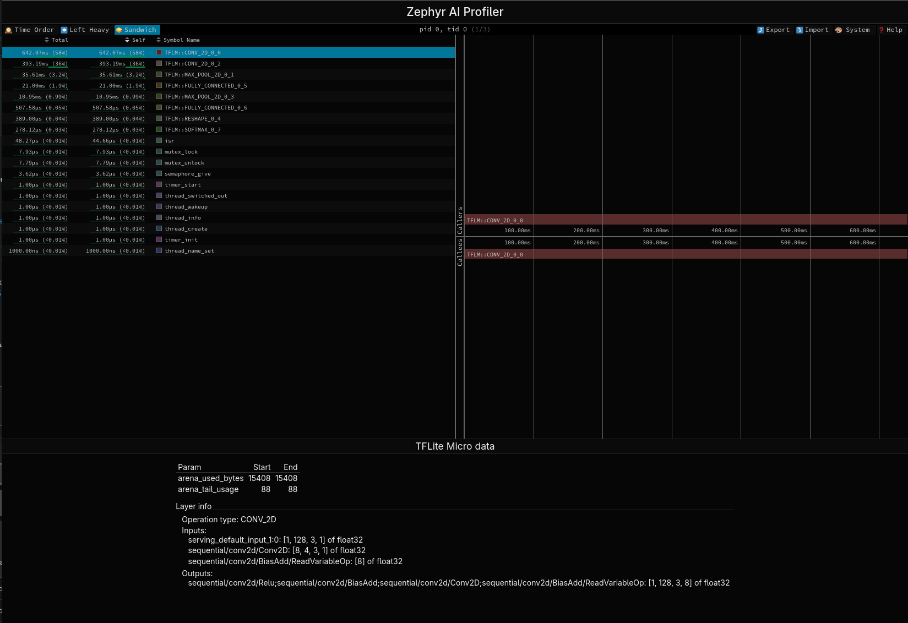

# Zeppelin Trace Viewer

The visual interface for traces (in Trace Event Format (TEF)) produced by
Zeppelin, the Zephyr AI Profiling Library.
It is based on [Speedscope](https://github.com/jlfwong/speedscope) with AI-specific information.



## Requirements

The visual interface leverages workspaces to manage a third-party dependencies like Speedscope.
This requires [yarn](https://yarnpkg.com/) in version newer than 1.x, provided by [corepack](https://github.com/nodejs/corepack#readme) (usually installed together with Node.js):
```bash
# Allows to use package manages without having to install them
corepack enable
# Downloads specified version of yarn and all dependencies
yarn
```

## Basic commands

- `yarn dev` - Starts a dev server at http://localhost:5173/
- `yarn build` - Builds for production, emitting to `dist/`
- `yarn preview` - Starts a server at http://localhost:4173/ to test production build locally
- `yarn lint` - Lints a code and applies all applicable fixes
