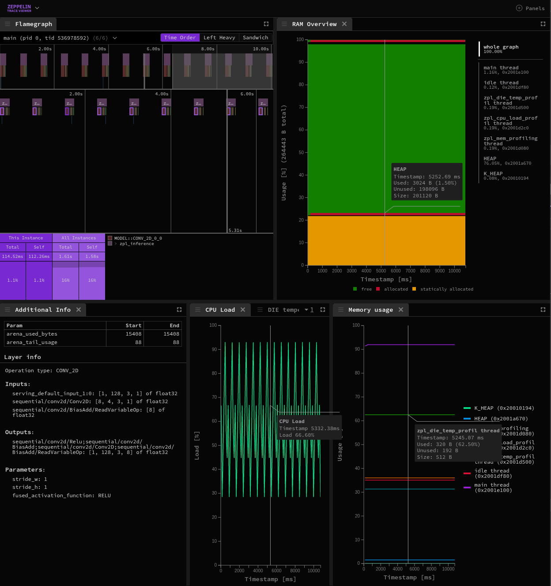

# Zeppelin Trace Viewer

Copyright (c) 2025 [Analog Devices, Inc.](https://www.analog.com/en/index.html)

Copyright (c) 2025 [Antmicro](https://www.antmicro.com)

Zeppelin Trace Viewer is a visualization tool for analyzing performance of Zephyr RTOS applications.

It visualizes traces, sensor readings and AI-related performance statistics collected by the Zeppelin tool.
It is built on top of:

* [Zeppelin](https://antmicro.github.io/zeppelin) library for collecting traces from Zephyr applications,
* [Speedscope](https://github.com/jlfwong/speedscope) tool for analyzing traces.

[Zeppelin documentation](https://antmicro.github.io/zeppelin) | [Trace Viewer](https://antmicro.github.io/zeppelin-trace-viewer)



## Requirements

The visual interface leverages workspaces to manage a third-party dependencies like [Speedscope](https://github.com/jlfwong/speedscope).
This requires [yarn](https://yarnpkg.com/) in version newer than 1.x, provided by [corepack](https://github.com/nodejs/corepack#readme), which is usually installed together with Node.js:
```bash
# Allows to use package manages without having to install them
corepack enable
# Downloads specified version of yarn and all dependencies
yarn
```

## Building and developing Zeppelin Trace Viewer

- `yarn dev` - Starts a development server at http://localhost:5173/
- `yarn build` - Builds the application for production, emitting to `dist/`
- `yarn preview` - Starts a server at http://localhost:4173/ to test production build locally
- `yarn lint` - Runs linter and applies fixes to code

## Documentation

Documentation for Zeppelin Trace Viewer is present in [Zeppelin documentation](https://antmicro.github.io/zeppelin).
